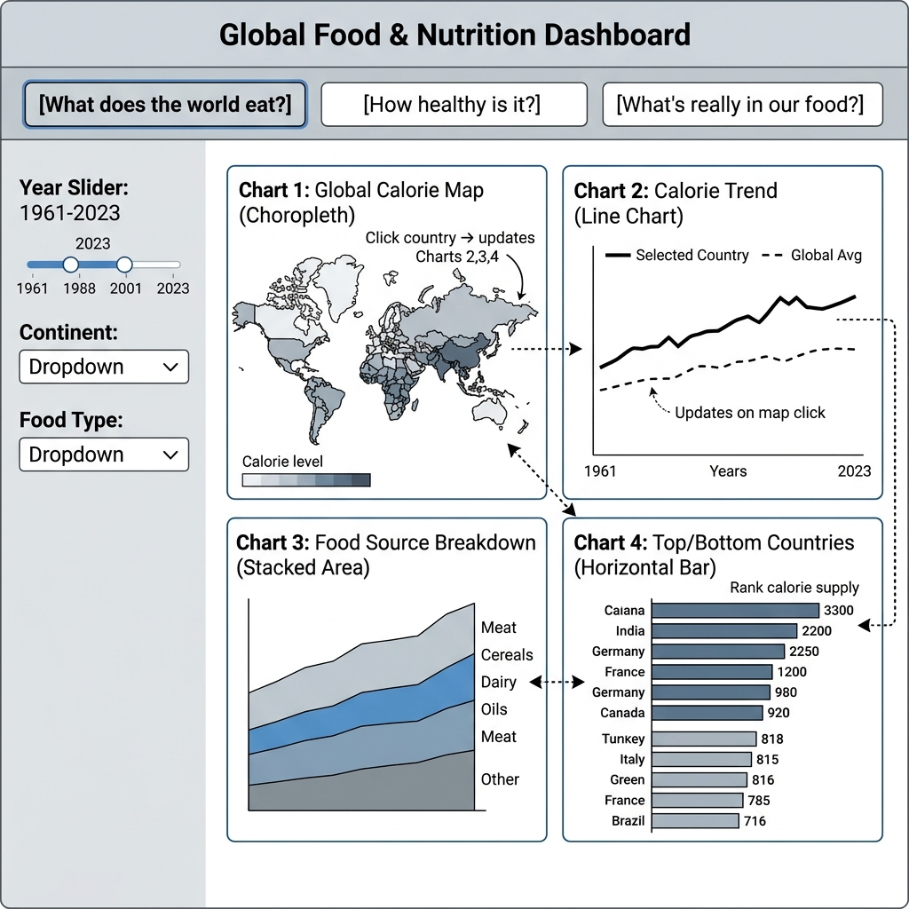
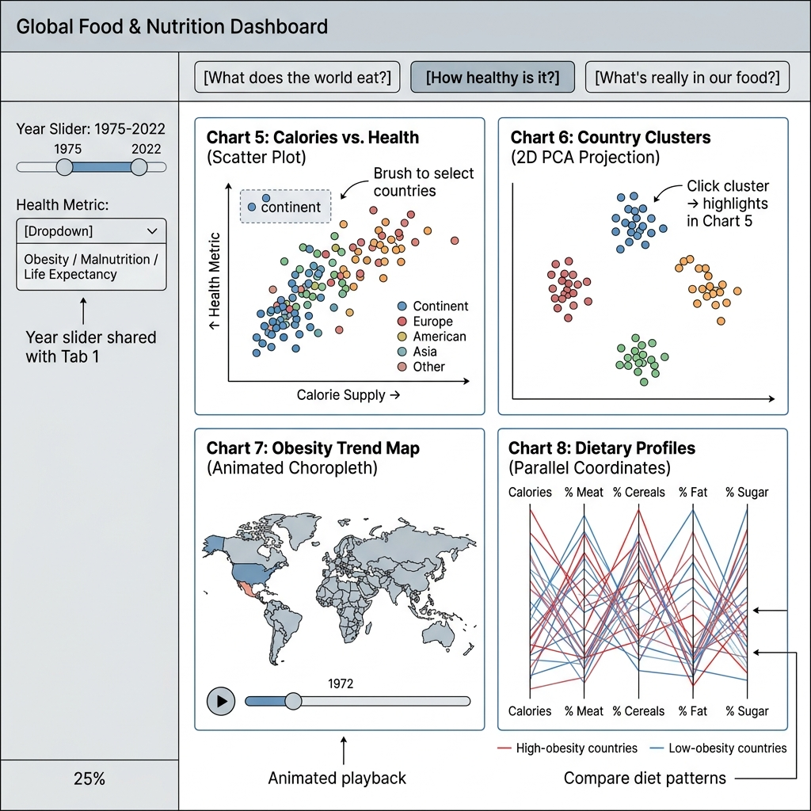
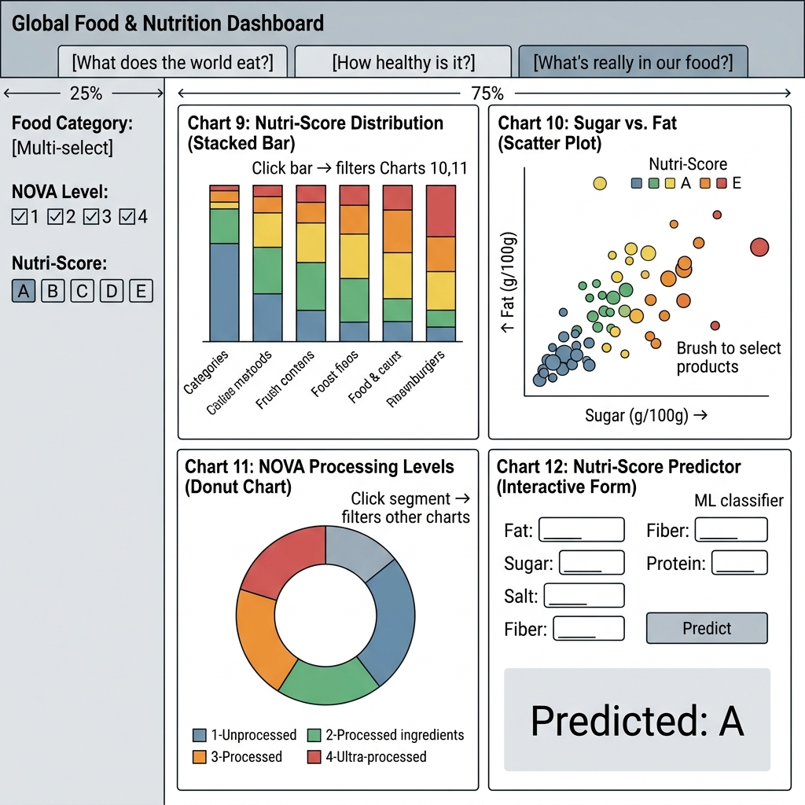

# Project Proposal: Global Food & Nutrition Dashboard

## 1. Proposal Write-up

### What we're storying

We are creating an interactive dashboard using Python Shiny to answer three core questions about our global food system, each mapped to a dedicated tab:

1. **"What does the world eat?"** — We examine how calorie supplies and food sources vary across 180+ countries over decades.
2. **"How healthy is it?"** — We link dietary patterns to health outcomes (obesity, malnutrition) and use ML models to uncover hidden relationships.
3. **"What's really in our food?"** — We zoom into thousands of food products to assess their nutritional quality using Nutri-Score and NOVA classifications.

### Why It Matters

More than 800 million people go hungry while over a billion struggle with obesity — often in the same countries. The data to understand these issues exists, but it is scattered across different organizations and formats, making it nearly impossible for anyone to see the full picture in one place. Our dashboard pulls these fragmented sources together into a single interactive experience so that students, researchers, or anyone curious about food systems can explore and learn from it.

### Our Datasets and Why They Fit

We selected datasets that directly serve each of our three questions:

| Question | Dataset | Coverage | Why It Fits |
|----------|---------|----------|-------------|
| **Q1: "What does the world eat?"** | [Our World in Data — Calorie Supply](https://ourworldindata.org/grapher/daily-per-capita-caloric-supply) | 200+ countries, 1961–2023 | Provides the long-term, country-level dietary trends needed to show how food consumption has shifted over six decades |
| | [Our World in Data — Food Composition](https://ourworldindata.org/grapher/dietary-composition-by-country) | 200+ countries, 1961–2023 | Breaks down calories by food group (meat, cereals, dairy) to reveal what people actually eat |
| **Q2: "How healthy is it?"** | [Our World in Data — Obesity](https://ourworldindata.org/grapher/share-of-adults-defined-as-obese) | 200+ countries, 1975–2016 | Links dietary patterns directly to obesity prevalence for correlation analysis |
| | [Our World in Data — Life Expectancy](https://ourworldindata.org/grapher/life-expectancy) | 200+ countries, 1543–2023 | Connects diet to broader health outcomes beyond obesity |
| | [WHO GHO — Adult Obesity & Child Underweight](https://ghoapi.azureedge.net/api/) | 190+ countries, 1975–2022 | Adds clinical health indicators with confidence intervals for ML modeling |
| **Q3: "What's really in our food?"** | [Open Food Facts](https://world.openfoodfacts.org/data) | ~10,000 products | The only dataset granular enough to assess individual products by Nutri-Score, NOVA level, and macronutrients |

All datasets are linked through standardized country identifiers and are downloaded automatically via a collection script in our repository.

### Why This Data is Hard to Visualize

1. **Scale mismatch.** Country-level aggregates (180 nations across 60 years) must coexist with product-level detail (thousands of items with 20+ attributes) in one coherent interface.
2. **Space and time together.** Geographic calorie patterns and their temporal evolution need linked, cross-filtered views — a single map or chart cannot capture both.
3. **High dimensionality.** Over 20 nutritional attributes per product require careful encoding to avoid visual clutter.
4. **Mixed variable types.** Numbers (calories), ranked scales (Nutri-Score A–E), and categories (food groups) each need different visual treatments, all working together seamlessly.

*(Word count: ~460)*

---

## 2. Wireframe Annotations & Layout Plan

### Interface Structure

- **Navigation:** Three tabs, one per core question. A global header shows the project title and active tab.
- **Layout per tab:** Left sidebar (~25% width) for filters, main panel (~75%) for charts in a 2×2 responsive grid.
- **Responsive behavior:** Charts sit side-by-side on desktop, stack vertically on smaller screens. Sidebar collapses on mobile.

---

### Tab 1: "What does the world eat?"

| Component | Details |
|-----------|---------|
| **Filters** | Year slider (1961–2023), Continent dropdown, Food Type dropdown |
| **Chart 1 — Global Calorie Map** (Choropleth) | Per-capita calorie supply across 200+ countries, color-coded by intake level. Hover = tooltip with values. Click a country = cross-filters Charts 2 & 3. |
| **Chart 2 — Calorie Trend** (Line Chart) | Historical calorie supply (1961–2023) for the selected country (bold) vs. global average (dashed). Updates on map click. |
| **Chart 3 — Food Source Breakdown** (Stacked Area) | How the composition of calories (meat, cereals, dairy, oils) has shifted over time for the selected country. |
| **Chart 4 — Top/Bottom Countries** (Horizontal Bar) | Ranking of the highest and lowest calorie-supply countries for the selected year. |

### Tab 2: "How healthy is it?"

| Component | Details |
|-----------|---------|
| **Filters** | Year slider (shared with Tab 1), Health Metric dropdown (Obesity / Malnutrition / Life Expectancy) |
| **Chart 5 — Calories vs. Health** (Scatter Plot) | X = calorie supply, Y = selected health metric. Dots colored by continent. Brushing selects countries and shows a summary. |
| **Chart 6 — Country Clusters** (2D Projection) | K-means clustering of countries by dietary profile, projected via PCA. Hover = dietary profile. Click a cluster = highlights those countries on Chart 5. |
| **Chart 7 — Obesity Trend Map** (Animated Choropleth) | How obesity prevalence has spread globally over decades. Animated playback with year controls. |
| **Chart 8 — Dietary Profiles** (Parallel Coordinates) | Compares dietary profiles (calories, % meat, % cereals, % fat, % sugar) of high-obesity vs. low-obesity countries side by side. Lines colored by obesity group. |

### Tab 3: "What's really in our food?"

| Component | Details |
|-----------|---------|
| **Filters** | Food Category multi-select, NOVA level checkboxes, optional Nutri-Score filter |
| **Chart 9 — Nutri-Score Distribution** (Stacked Bar) | Nutri-Score (A–E) breakdown per food category. Click a bar segment = filters Charts 10 & 11. |
| **Chart 10 — Sugar vs. Fat** (Scatter Plot) | Per-product sugar (X) vs. fat (Y), colored by Nutri-Score, sized by calories. Brushing selects products for detail view. |
| **Chart 11 — NOVA Processing Levels** (Donut Chart) | Proportion of products by NOVA processing group (1–4). Click a segment = filters the other charts. |
| **Chart 12 — Nutri-Score Predictor** (Interactive Form) | ML classifier that predicts Nutri-Score from user-input macronutrients (fat, sugar, salt, fiber, protein). |

### Interactivity & Cross-Filtering

- **Within tabs:** Clicking a country on the map (Chart 1) updates the trend line (Chart 2), food breakdown (Chart 3), and ranking highlight (Chart 4). Brushing the scatter plot (Chart 5) highlights countries in the cluster view (Chart 6). Clicking a Nutri-Score bar (Chart 9) filters the scatter (Chart 10) and donut (Chart 11).
- **Across tabs:** Clicking a country on Tab 1 pre-selects it when navigating to Tab 2. The year slider persists across Tabs 1 and 2.
- **Tab 3** operates independently (product-level dataset).
- **All charts** use Plotly with built-in zoom, pan, hover tooltips, and PNG export.

### Wireframe Sketches

---

## 3. Presentation Slides Outline (5 Minutes)

- **Slide 1:** Title, team (Nguyen Thi Tra My — V202503042, Tran Thi Hoai Phuong — V202502962), [GitHub link](https://github.com/miinguyen/global-food-nutrition-dashboard).
- **Slide 2:** Three-part question, dashboard structure, and project timeline.
- **Slide 3:** Four datasets, integration challenges (ISO-3 codes, mixed formats).
- **Slide 4:** Wireframe walkthrough, interactive features (cross-filtering, brushing), ML components (Nutri-Score prediction, clustering, regression).
- **Slide 5:** Task allocation and next steps (data pipeline → MVP → final submission).
